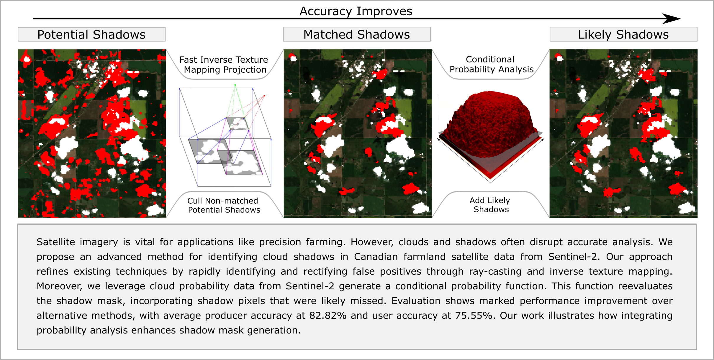

# Cloud Shadow Detection Over Canadian Farmland via Ray-casting with Probability Analysis Refinement using Sentinal-2 Satellite Data

by
Jeffrey Layton (jeffrey.layton@ucalgary.ca),
Lakin Wecker,
Dr. Adam Runions,
Dr. Faramarz Samavati



## Software implementation

This software is an implementation of our cloud shadow detection system.
It will read the relevent input files from a source directory, compute the resulting outputs,
and run the custom GUI to inspect results and/or output the results to the output directory.

## Getting the code

You can clone the repo with the following:

```
git clone https://github.com/JeffreyLayton/Cloud-Shadow-Detection.git
```

## Dependencies

The system was developed and tested on modern x64 windows machines (10 or 11).
As such, support is limited to modern windows machines. The program was written for the C++20 standard or later.
As the code uses a GUI system and levereges [OpenGL](https://www.khronos.org/opengl/wiki/Getting_Started) Shader Storage Buffers, a minimum of OpenGL 4.3 is required. However, we suggest OpenGL 4.6.

Our system uses [Conan](https://conan.io/), specifically [Conan-v1.X](https://docs.conan.io/1/index.html), to manage our dependencies. 

To install Conan, you first need to install [Python 3](https://www.python.org/downloads/), [pip](https://pip.pypa.io/en/stable/installation/), 
[CMake](https://cmake.org/install/), and the python package [Poetry](https://python-poetry.org/docs/#installing-with-the-official-installer).

Once all the above have been installed, run the 

We used the following libraries:

* [lyra - 1.6.1](https://www.bfgroup.xyz/Lyra/)
* [tomlplusplus - 3.3.0](https://marzer.github.io/tomlplusplus/)
* [eigen - 3.4.0](https://eigen.tuxfamily.org/index.php?title=Main_Page)
* [jbig](https://github.com/ImageMagick/jbig)
* [imgui - 1.81](https://www.dearimgui.com/)
* [nlohmann_json - 3.11.2](https://github.com/nlohmann/json)
* [glad - 0.1.36](https://glad.dav1d.de/)
* [glm - 0.9.9.8](https://github.com/g-truc/glm)
* [glfw - 3.3.8](https://www.glfw.org/)
* [zlib - 1.2.13](https://www.zlib.net/)
* [libtiff - 4.5.0](https://libtiff.gitlab.io/libtiff/)
* [boost - 1.82.0](https://github.com/KhronosGroup/OpenCL-Headers)
* [OpenCL-Headers - 2023.04.17](https://github.com/KhronosGroup/OpenCL-Headers)
* [OpenCL-ICD-Loader - 2023.04.17](https://github.com/KhronosGroup/OpenCL-ICD-Loader)

## Setting up the code environment and building

To set up the code environment, run the following commands in the root project directory:
```
poetry shell
poetry update
*(Check to see if conan version is 1.x: conan --version)*

conan profile new shadow_detection --detect
conan profile update settings.compiler.cppstd=20 shadow_detection
conan profile update conf.tools.system.package_manager:mode=install shadow_detection
conan profile update conf.tools.system.package_manager:sudo=True shadow_detection

conan install . -s build_type=RelWithDebInfo -b outdated --update -pr:b=shadow_detection -pr:h=shadow_detection
```

To build the code, open the repo in Visual Studio 2022, configure the project using the CMakeLists.txt, and build using the appropriate dev configureation (dev-win64 is recommended).
Alternatively, you can build the code from the command line by using the following commands in the build directory (with your approprate build paths):

```
cmake --preset=dev-win64
cmake --build --preset=dev-win64
```
## Running the code

Once built, run the code with the following command line parameters:

### Flags:
| Flag | Description |
|:---:|:---|
| g | Run the GUI to inspect results (Only on Cloud-Shadow-Detection) |

### Parameters:
| Parameter | Description |
|:---:|:---|
| data_path | Path to a .toml file containing the data section (REQUIRED) |
| output_path | Path to a .toml file containing the output section (OPTIONAL, will try data_path if ommited but won't fail if not there either) |

Example .toml files can be found in [toml-templates](toml-templates) folder.

### Data TOML:

Inside our TOML file containing our data input, the following information is accepted:

| Name | Description | Channels | Bytes Per channel | Type | Cloud-Shadow-Detection | Height-Variation |
|:---:|:---|:---:|:---:|:---:|:---:|:---:|
| ID | Unique ID so output jsons can be identified | - | - | String | Required | Required |
| bbox | Lat Long pair in a 4 long array specifying Min long lat and Max long lat | - | - | Float | Required | Required |
| NIR_path | The near infrared reflectance band | 1 | 2 | Unsigned Integer | Required | - |
| RBGA_path | The coloured (with alpha) image | 4 | 1 | Unsigned Integer | Optional | - |
| CLD_path | The cloud probability band (Sen2Cor)| 1 | 1 | Unsigned Integer | Required | - |
| CLP_path | The cloud probability band (s2cloudless) | 1 | 1 | Unsigned Integer | Required | - |
| SCL_path | The scene classification layer | 1 | 1 | Unsigned Integer | Required | - |
| SunZenith_path | The sun zenith angle band | 1 | 4 | Float | Required | - |
| SunAzimuth_path | The sun azimuth angle band | 1 | 4 | Float | Required | - |
| ViewZenith_path | The view zenith mean angle band | 1 | 4 | Float | Required | Required |
| ViewAzimuth_path | The sun azimuth mean angle band | 1 | 4 | Float | Required | Required |
| ShadowBaseline_path | The manually generated baseline band painted in RBGA format | 4 | 1 | Unsigned Integer | Optional | - |

Any entry as required must be specified for the system to work. Optional inputs will give a warning if ommited or failed.

### Output TOML:

Inside our TOML file containing our output specifications, the following information is accepted:

| Name | Description | Channels | Bytes Per channel | Type | Cloud-Shadow-Detection | Height-Variation |
|:---:|:---|:---:|:---:|:---:|:---:|:---:|
| CM_path | The cloud mask generated | 1 | 1 | Unsigned Integer | Optional | - |
| PSM_path | The potential shadow mask generated | 1 | 1 | Unsigned Integer | Optional | - |
| OSM_path | The object-based shadow mask generated | 1 | 1 | Unsigned Integer | Optional | - |
| FSM_path | The final shadow mask generated | 1 | 1 | Unsigned Integer | Optional | - |
| Alpha_path | That alpha map generated | 1 | 4 | Float| Optional | - |
| Beta_path | That beta map generated | 1 | 4 | Float | Optional | - |
| PSME_path | The evaluation of the potential shadow mask | 1 | 1 | Unsigned Integer | Optional | - |
| OSME_path | The evaluation of the object-based shadow mask | 1 | 1 | Unsigned Integer | Optional | - |
| FSME_path | The evaluation of the final shadow mask | 1 | 1 | Unsigned Integer | Optional | - |
| EvaluationMetric_path | The results of the evaluation metrics for shadow detection | 4 | 1 | json | Optional | - |
| HeightVariationMetric_path | The results of the least squared solution at various view heights | 4 | 1 | json | - | Optional |

All outputs are optional and if not ommited and correct, the output will be saved.

## Reproducing the results

The results generation is managed by a seperate repository named [Cloud-Shadow-Detection-Result-Generation](https://github.com/JeffreyLayton/Cloud-Shadow-Detection-Result-Generation) that utilizes the cloud detection executable. See that project's documentation for specifics.

## License

This repository in licensed under the [MIT License](LICENSE.md).
